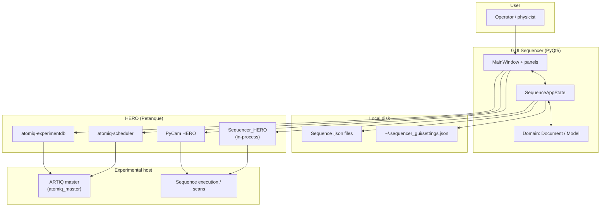
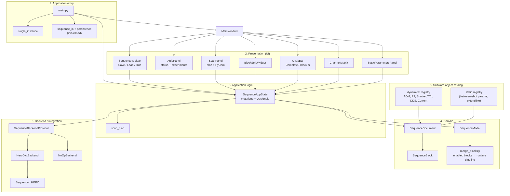
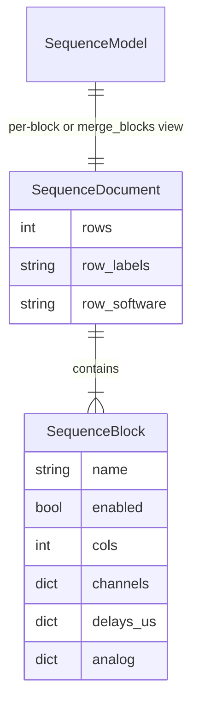
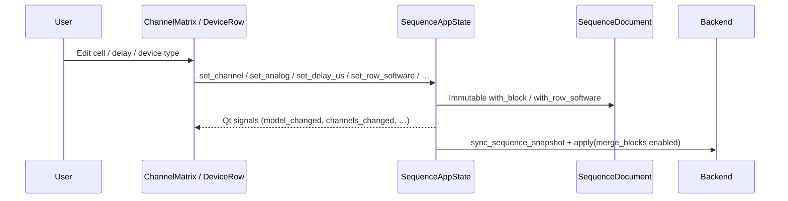
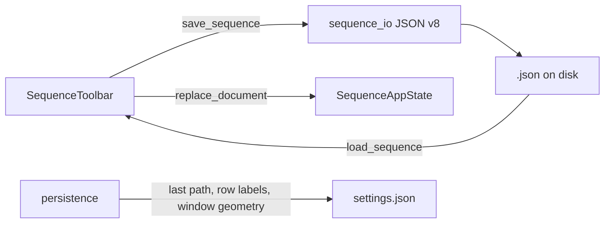
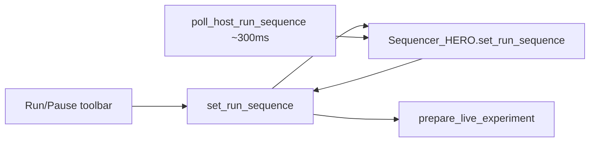
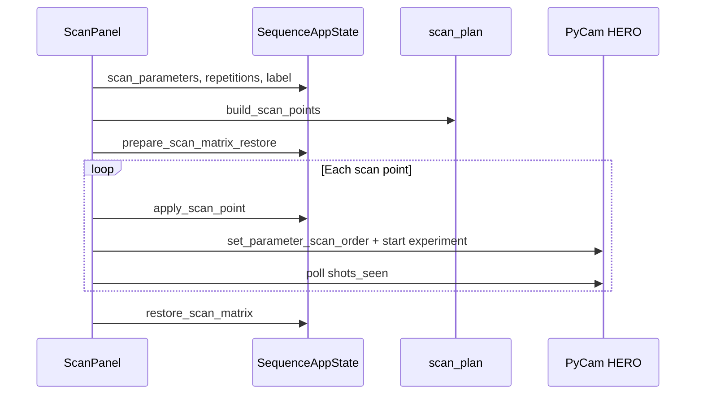
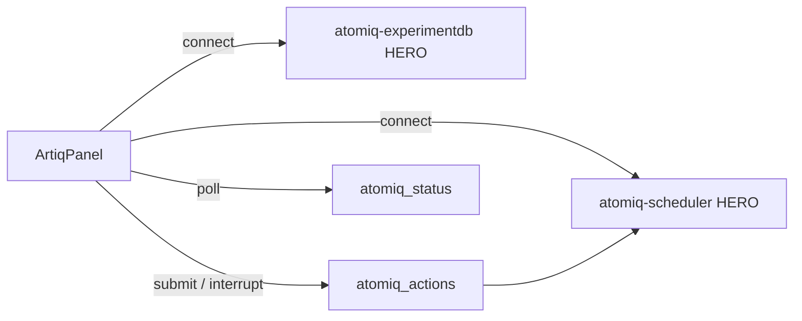
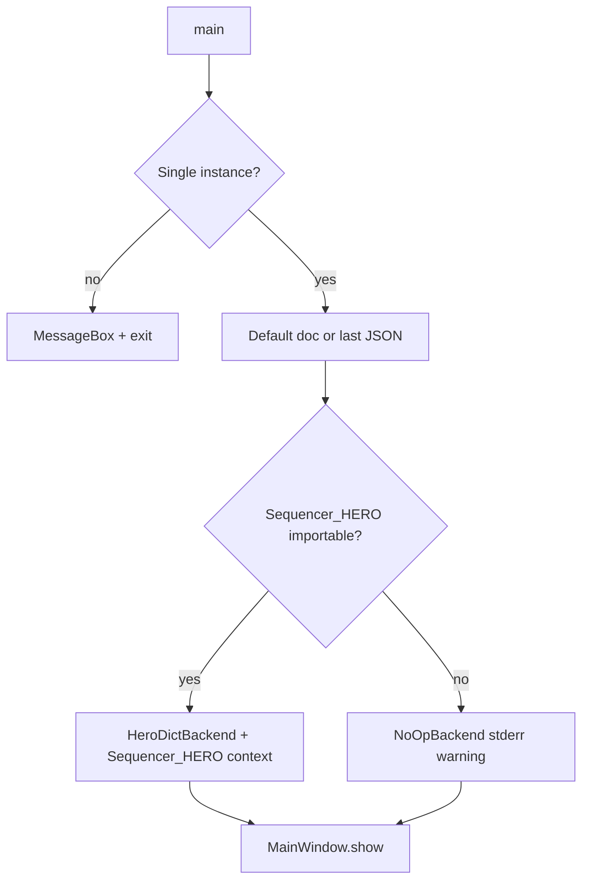

# Functional architecture — GUI Sequencer

This document describes how **Petanque Sequencer** works: purpose, layers, data model, integration with HERO/ARTIQ/PyCam, and main control flows. It is intended for onboarding, design reviews, and future development.

**Last aligned with codebase:** May 2026.

---

## 1. Purpose

**GUI Sequencer** is a **PyQt5** desktop application for editing **ArtiQ experimental sequences**:

- A **timeline matrix**: per device row, per time step — digital ON/OFF (where applicable), delays (µs), and analog parameters (or *hold*).
- **Blocks**: named, reorderable segments; only **enabled** blocks are concatenated for runtime.
- **Complete** tab: merged view of all enabled blocks (same shape sent to the host).
- **Parameter scans**: vary matrix values over a grid; integrate with **PyCam** for data tagging.
- **Live run/pause** and **ARTIQ master** supervision via **HERO** (Petanque stack).

Persistence: versioned **JSON** sequence files plus local UI settings (`~/.sequencer_gui/settings.json`).

---

## 2. Context diagram (external systems)

---

## 3. Layered architecture

### Layer responsibilities

| Layer | Responsibility |
|-------|----------------|
| **Entry** | Single GUI instance, icon/font, load last sequence or defaults, attach `HeroDictBackend` or `NoOpBackend`. |
| **UI** | Reflect `SequenceAppState`; edit matrix, blocks, scan config, ArtiQ actions; no business rules duplicated long-term. |
| **App state** | Own `SequenceDocument`, active tab, scan/run flags; emit signals; call backend on every commit. |
| **Domain** | Immutable dataclasses; `merge_blocks` for runtime; column mapping Complete ↔ block index. |
| **Software objects** | Per-row device type: which params exist, ON/OFF strip, defaults, display. |
| **Backend** | Push snapshot JSON to `Sequencer_HERO`; sync run/pause and burst shot budget. |

---

## 4. Data model

### 4.1 Concepts

| Concept | Meaning |
|---------|---------|
| **Row** | One hardware/software channel (default **20** rows, `DEFAULT_DEVICE_ROWS`). Has label + **dynamical** object id (e.g. AOM, DDS). |
| **Block** | Named timeline segment: `cols` time steps, `enabled` flag, channels, delays, analog, optional accent color. |
| **Column** | One time step: delay (µs), booleans, analog cells (`float` or hold). |
| **Complete** | Tab index `-1`: UI shows `merge_blocks(document, enabled_only=True)`. Edits map back to underlying blocks. |
| **Scan** | Axes: device label, param id, timestep label, value list; temporarily patches matrix then restores. |

### 4.2 Entity relationship

### 4.3 Key types (source)

| Type | Module | Role |
|------|--------|------|
| `SequenceDocument` | `domain/document.py` | Shared rows + ordered `blocks`. |
| `SequenceBlock` | `domain/document.py` | Timeline payload for one block. |
| `SequenceModel` | `domain/model.py` | Flat view: rows × cols for one block or merged timeline. |
| `AnalogStored` | `domain/analog_stored.py` | Float or hold sentinel. |
| `SequenceAppState` | `app/state.py` | Mutable session; `COMPLETE_TAB_INDEX = -1`. |

**Runtime snapshot:** `merge_blocks(doc, enabled_only=True)` → `SequenceModel` passed to `backend.apply()`. Full document + name → `backend.sync_sequence_snapshot()` (same shape as saved JSON via `live_sequence_file_dict`).

---

## 5. Main functional flows

### 5.1 Editing the sequence

### 5.2 Save and load

- Format id: `sequencer_gui_sequence`, version **8** (`sequence_io.FORMAT_VERSION`).
- Blocks store `device_rows["0"]…` with `states` and analog param lists (`frequency`, `amplitude`, …).
- Older files with fewer rows are **upgraded** on load to `DEFAULT_DEVICE_ROWS`.

### 5.3 Live run / pause

- `BURST_SHOTS_UNLIMITED` (-1): live mode until user pauses.
- Scan mode uses `sync_burst_shots(n)` then `set_run_sequence(True)` per step.

### 5.4 Parameter scan

Scan label availability (red/blue/green) comes from `pycam_repository.classify_scan_label` (today’s data folders).

### 5.5 ArtiQ master panel

Default sequencer experiment key: `Sequencer_mode.py` (`ATOMIQ_SEQUENCER_MODE_EXPERIMENT_KEY`).

### 5.6 Application startup

Bypass single instance: `SEQUENCER_ALLOW_MULTIPLE=1`. Optional HERO preload: `SEQUENCER_HERO_INIT_JSON`.

---

## 6. Main window layout (UI map)

`MainWindow` (`ui/main_window.py`) vertical layout:

1. **Top row:** `SequenceToolbar` | `ArtiqPanel` | `ScanPanel` (stretch)
2. **Block strip:** `BlockStripWidget` — enable, reorder, add/remove blocks
3. **Tabs:** Complete + one tab per block
4. **Matrix row:** `ChannelMatrix` (stretch) | `StaticParametersPanel` (collapsible)

On close: commit row/column labels, save row labels and window geometry to settings.

---

## 7. Software objects (device catalog)

### 7.1 Dynamical (timeline) — `software_objects/dynamical/`

Registered in `dynamical/registry.py` (`CATALOG_ORDER`):

| Object id | Typical role |
|-----------|----------------|
| AOM | ON/OFF + amplitude |
| RF source | RF analog parameters |
| Shutter | ON/OFF |
| TTL | ON/OFF |
| DDS | Frequency (detuning), etc. |
| Current source | Current analog parameter |

Each implements `SoftwareObject` (`protocol.py`): `has_on_off`, `analog_parameters` (`AnalogParameterSpec`).

`get_object(id)` returns a stub for unknown ids (safe load of old files).

### 7.2 Static (between shots) — `software_objects/static/`

Same registry pattern as dynamical (`registry.py`, `register`, `get_object`, `iter_objects`, `CATALOG_ORDER`). VOA devices are defined in `static/voa.py` (ten instances, amplitude **0–5 V**). UI: `StaticParametersPanel`. Storage: `SequenceDocument.static_values`, JSON `document.static`. Matrix row dropdown uses dynamical catalog only.

### 7.3 Re-exports

`software_objects/__init__.py` re-exports dynamical `get_object`, `iter_objects` for backward compatibility.

---

## 8. HERO and process identity

Constants in `process_identity.py`:

| Symbol | Value | Usage |
|--------|-------|--------|
| `HERO_INSTANCE_NAME` | `Sequencer_HERO` | In-process `LocalHERO`; JSON snapshot + run/burst |
| `PYCAM_HERO_INSTANCE_NAME` | `PyCam_HERO` | Scan + live experiment |
| `ATOMIQ_SCHEDULER_HERO_NAME` | `atomiq-scheduler` | Scheduler status / submit |
| `ATOMIQ_EXPERIMENTDB_HERO_NAME` | `atomiq-experimentdb` | List experiments |
| `PYCAM_LIVE_EXPERIMENT_NAME` | `Running_without_scan` | Live run repo name |
| `BURST_SHOTS_UNLIMITED` | `-1` | Unlimited shots in live mode |

`Sequencer_HERO` (`sequencer_hero.py`):

- Holds `_sequence_data` dict (same as `dict` attribute for heros capabilities).
- `set_sequence_data`, `set_run_sequence`, `set_burst_shots`.
- Parameter revision / ack for cross-process stale detection (`get_seq_parameters_stale`, etc.).

`HeroDictBackend` (`app/hero_dict_backend.py`): on each document change, `set_sequence_data(live_sequence_file_dict(...))`; `apply(merged model)` is a no-op (snapshot carries full document).

---

## 9. Module reference

| Module / package | Function |
|------------------|----------|
| `main.py` | `QApplication`, backend selection, `MainWindow` |
| `single_instance.py` | Windows/file lock — one GUI instance |
| `app/state.py` | Central state, scan restore, tab/block ops |
| `app/backend.py` | `SequenceBackendProtocol`, `NoOpBackend` |
| `app/hero_dict_backend.py` | HERO dict sync |
| `domain/document.py` | Document, block, merge, Complete column mapping |
| `domain/model.py` | Flat model, analog resolution (hold chain) |
| `sequence_io.py` | JSON v8 load/save, validation, hero block import |
| `persistence.py` | `~/.sequencer_gui/settings.json` |
| `scan_plan.py` | Scan bindings, points, duration estimate |
| `sequencer_hero.py` | `Sequencer_HERO` LocalHERO implementation |
| `atomiq_status.py` | Scheduler snapshot |
| `atomiq_actions.py` | Submit / interrupt experiments |
| `pycam_experiment.py` | Live + scan PyCam calls |
| `pycam_repository.py` | Scan label folder classification |
| `ui/channel_matrix.py` | Grid widget |
| `ui/device_row.py` | Per-row editors |
| `ui/block_strip.py` | Block management UI |
| `ui/sequence_toolbar.py` | File + run + timing labels |
| `ui/scan_panel.py` | Scan UI + PyCam loop |
| `ui/artiq_panel.py` | ArtiQ status and actions |
| `ui/static_parameters_panel.py` | Static params sidebar |

---

## 10. Dependencies and deployment

| Dependency | Role |
|------------|------|
| PyQt5 | UI |
| numpy | HERO / ARTIQ types in `Sequencer_HERO` |
| Petanque `heros` (editable) | `LocalHERO`, ARTIQ compile — see `requirements-artiq.txt` |
| atomiq / ARTIQ master | Optional; ArtiqPanel |
| PyCam HERO | Optional; scan and live run |

**Run:** `python -m sequencer_gui` or console script `sequencer-gui`.

**Without heros:** GUI runs with `NoOpBackend` (no live dict sync); stderr warns on import failure.

---

## 11. Design notes for future work

- **Static parameters:** UI panel present; register types in `software_objects/static/` and wire state/backend when host API is ready.
- **Complete tab:** Edits resolve to block-local columns via `merged_enabled_timeline_col_to_block`; read-only if no block enabled (placeholder timeline).
- **Run sequence flag:** Not persisted in JSON; host-only via HERO.
- **Scan metadata:** Label, repetitions, parameter list are UI/state; execution ties to PyCam + matrix patching.

---

## 12. Related files to keep in sync

When changing behavior, update this doc if you alter:

- `FORMAT_VERSION` or JSON schema (`sequence_io.py`)
- HERO instance names (`process_identity.py`)
- Default row count (`DEFAULT_DEVICE_ROWS` in `domain/model.py`)
- Dynamical catalog (`dynamical/registry.py` `CATALOG_ORDER`)
- Main window composition (`ui/main_window.py`)
